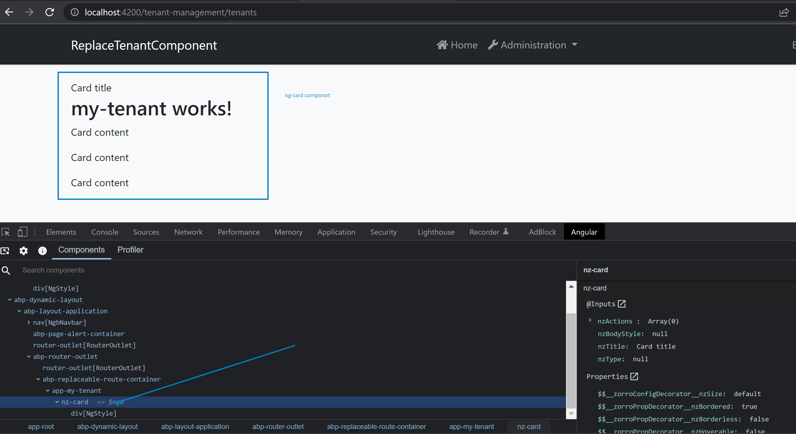

# An example Abp app with Angular UI for replacing tenant component with a custom component that has 3. party component/dependency

My-tenant-component is replaced component. It has `nz-card` (from Ant design lib.).
In the example, I added `my-tenant component` to App.module.ts. Also, I added  `NzCardModule` to App.module.ts.Usually, we don't need to add a replaceable component to a module.
 but we want to declare its own 3. party dependencies a module (for  the DI can create with these dependencies) 
due that I've added  `my-tenant component` to App.module.ts. Now it works with `nz-card`

.

